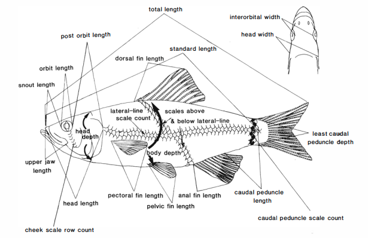

```{r setup, include=FALSE}
#knitr::opts_chunk$set(echo = TRUE, fig.width = 5, fig.asp = 1/3)
library(tidyverse)
library(knitr)
library(leaflet)


```

## Introduction

My thesis is looking at the diversity within a small-bodied freshwater fish species, the Blackside Snubnose Darter (*Etheostoma duryi*).


While this species is conservative with meristic variation, we can investigate a suite of traits to assess some diversity.



```{r Map, echo=FALSE}
leaflet() %>%
  setView(-86.081163, 35.484613, zoom = 14) %>% 
  addTiles() %>%
  addMarkers(-86.081163, 35.484613, popup = "Duck River")
```

Below are some analyses that can be done just with the data collected thus far.

```{r Input Data, include = FALSE}
counts <- read.csv("data/E.duryi.Meristics.csv", header = TRUE)
glimpse(counts)
counts$Locality <- as.factor(counts$Locality)

```

## Analyses with Meristics 

We have data for `r nrow(counts)` *Etheostoma duryi* specimens that were housed in museums.

```{r Summaries, echo=FALSE}
summary1 <- summarise(group_by(counts, Locality), 
                      n=n(),
                      minimum = min(Lateral.Line),
                      maximum = max(Lateral.Line))
kable(summary1, caption = 'Table 1. A summary kable displaying minimum and maximum lateral line scales for each locality')

```

```{r Frequency Tables, echo =FALSE}
LLtable <- table(counts$Locality , counts$Lateral.Line)
A.LLtable <- table(counts$Locality, counts$Above.Lateral.Line)
B.LLtable <- table(counts$Locality, counts$Below.Lateral.Line)
Tr.table <- table(counts$Locality, counts$Transverse)
CPtable <- table(counts$Locality, counts$Caudal.Peduncle)
D1table <- table(counts$Locality, counts$D1)
D2table <- table(counts$Locality, counts$D2)
ANtable <- table(counts$Locality, counts$A1)
Pectable <- table(counts$Locality, counts$P1)

kable(Pectable, caption = 'Frequency table showing modal values for pectoral fin rays per locality.')
kable(D1table, caption = 'Frequency table showing modal values for dorsal fin spines per locality')
kable(LLtable, caption = 'Frequency table showing modal values for lateral line scales per locality')

```

```{r Lateral Line BoxPlot, warning=FALSE}
ggplot(counts, aes(x = Locality, y = Lateral.Line))+
  geom_boxplot()

ggsave('LocalityvsLateralLine.png')
```
```{r Lateral Line vs SL, warning=FALSE}
ggplot(counts, aes(x = SL..mm., y = Lateral.Line, colour = Locality))+  geom_point()
ggsave('LocalityvsSLvsLL.png') 
```


## Testing Models
Looking at somewhat random models
```{r Testing models}
plot(Lateral.Line ~ SL..mm., data = counts)
sizeLLmodel <- lm(Lateral.Line ~ SL..mm., data = counts)
abline(sizeLLmodel)
anova(sizeLLmodel)

plot(Caudal.Peduncle ~ SL..mm., data = counts)
sizeCPmodel <- lm(Caudal.Peduncle ~ SL..mm., data = counts)
anova(sizeCPmodel)
```

